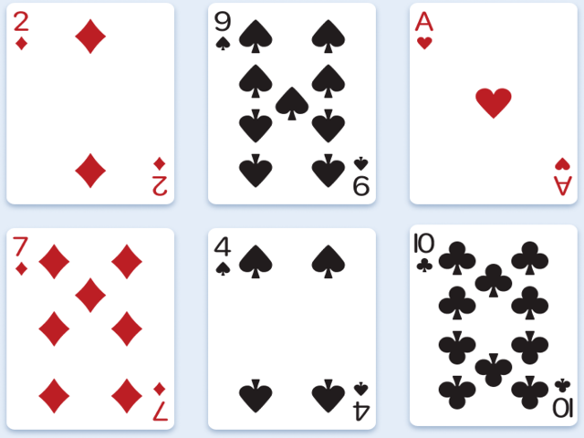
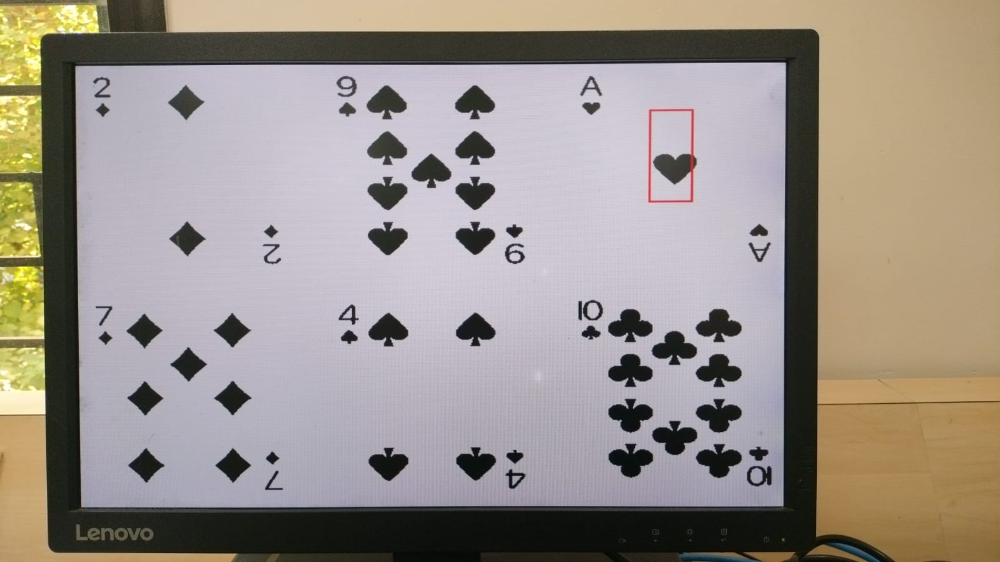
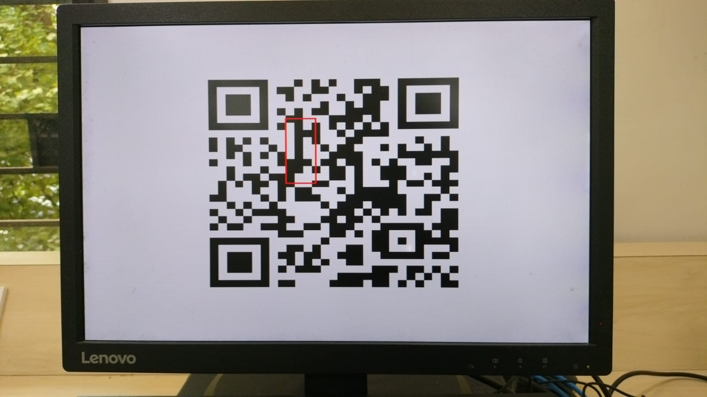
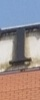
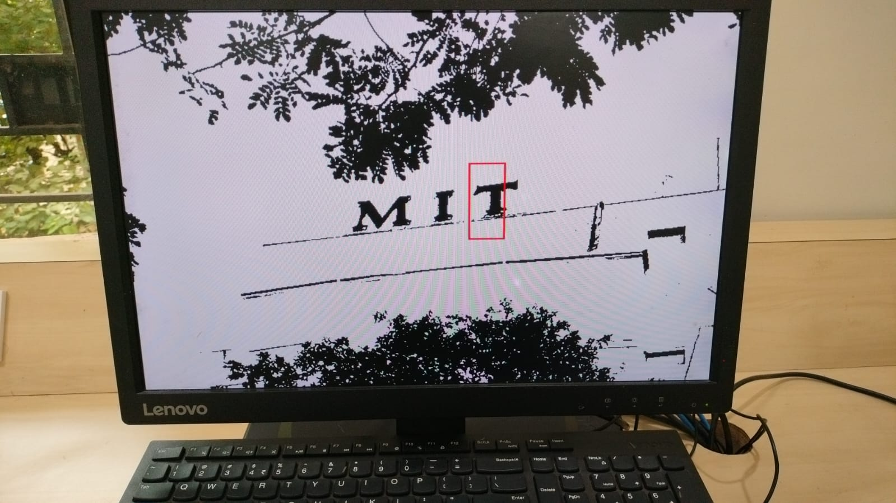

# FPGA-Based Template Matching using SAD Algorithm

A hardware implementation of a **Template Matching System** using the **Sum of Absolute Differences (SAD)** algorithm on a **Xilinx Artix-7 (Nexys 4 DDR)** FPGA.

We used a **40-element systolic processing array** in Verilog, enabling parallel comparison of a binary template against a source image. MATLAB is used for image preprocessing, while Vivado is used for synthesis, implementation, and FPGA deployment.

> **Note:** The high-level architecture used here is adapted from the reference paper by **T. Adiono et al.** The hardware implementation, Xilinx-compatible modules, integration, synthesis, verification, and FPGA deployment in this repository were developed as part of this project.

---

## Overview

Template matching is a common computer vision technique used to locate an object inside a larger image. Traditional software implementations are computationally expensive because every possible window must be compared sequentially.

This project accelerates the process by implementing the matching algorithm completely in hardware using:

- Binary Sum of Absolute Differences (SAD)
- Parallel Processing Elements (PEs)
- Systolic Array Architecture
- FPGA Block RAM
- VGA output for displaying detection results

---

## Features

- Binary SAD-based template matching
- 40 Processing Element (PE) systolic array
- Parallel hardware implementation in Verilog
- MATLAB preprocessing pipeline
- Block RAM image storage
- VGA display with detected object location
- Seven-segment display for debugging
- Successfully synthesized and implemented on Nexys 4 DDR FPGA

---

## Hardware

- Nexys 4 DDR Development Board
  
- Xilinx Artix-7 FPGA (XC7A100T)
- VGA Monitor
- USB Programming Cable

---

## Software

- Xilinx Vivado 2025.2
- MATLAB R2025a
- Verilog HDL

---

## System Specifications

| Parameter | Value |
|-----------|-------|
| Source Image | 640 × 480 |
| Template Size | 40 × 100 |
| Processing Elements | 40 |
| Matching Clock | 75 MHz |
| VGA Clock | 25 MHz |
| Matching Metric | Binary SAD |

---

## System Architecture

```
Source Image
      │
      ▼
MATLAB Preprocessing
(Grayscale + Binarization)
      │
      ▼
input_image.bin
template.mem
      │
      ▼
FPGA Block RAM
      │
      ▼
40-PE Systolic Array
      │
      ▼
Binary Tree Adder
      │
      ▼
Minimum SAD Detection
      │
      ├────────► Seven Segment Display
      ▼
 VGA Output
```

---

## Processing Pipeline

1. Capture input image.
2. Convert RGB image to grayscale.
3. Binarization.
4. Export images as memory files.
5. Load images into FPGA BRAM.
6. Perform parallel SAD computation.
7. Find global minimum SAD.
8. Display detected object through VGA.

---

## Project Structure

```
├── rtl/
│   ├── processor.sv
│   ├── processor_array.sv
│   ├── treeadder.sv
│   ├── object_match.sv
│   ├── vga_controller.sv
│   └── ...
│
├── matlab/
│   ├── preprocess_image.m
│   ├── generate_template.m
│   └── ...
│
├── constraints/
│   └── nexys4.xdc
│
├── images/
│
├── docs/
│
└── README.md
```

---

## Results
<p align="center">
  
      &nbsp;&nbsp;&nbsp;&nbsp;&nbsp;&nbsp;&nbsp;&nbsp;
  
      &nbsp;&nbsp;&nbsp;&nbsp;&nbsp;&nbsp;&nbsp;&nbsp;
  
</p>

<p align="center">
<b>Input Image 1</b> &nbsp;&nbsp;&nbsp;&nbsp;&nbsp;&nbsp;
<b>Template 1</b> &nbsp;&nbsp;&nbsp;&nbsp;&nbsp;&nbsp;
<b>Detection Result 1</b>
</p>
<p align="center">
  
      &nbsp;&nbsp;&nbsp;&nbsp;&nbsp;&nbsp;&nbsp;&nbsp;
  
      &nbsp;&nbsp;&nbsp;&nbsp;&nbsp;&nbsp;&nbsp;&nbsp;
  
</p>

<p align="center">
<b>Input Image 2</b> &nbsp;&nbsp;&nbsp;&nbsp;&nbsp;&nbsp;
<b>Template 2</b> &nbsp;&nbsp;&nbsp;&nbsp;&nbsp;&nbsp;
<b>Detection Result 2</b>
</p>

<p align="center">
  
      &nbsp;&nbsp;&nbsp;&nbsp;&nbsp;&nbsp;&nbsp;&nbsp;
  
      &nbsp;&nbsp;&nbsp;&nbsp;&nbsp;&nbsp;&nbsp;&nbsp;
  
</p>

<p align="center">
<b>Input Image 3</b> &nbsp;&nbsp;&nbsp;&nbsp;&nbsp;&nbsp;
<b>Template 3</b> &nbsp;&nbsp;&nbsp;&nbsp;&nbsp;&nbsp;
<b>Detection Result 3</b>
</p>


- Successfully implemented on **Xilinx Artix-7 FPGA**
- Parallel template matching using 40 Processing Elements
- VGA output displaying detected object location
- Hardware verified through multiple test cases
- Timing successfully closed at **75 MHz**

---

## Future Improvements
- UART to send data
- Multiple template support
- Color image matching
- Higher image resolutions
- AXI/APB interface integration
- Real-time video processing

---

## References

- T. Adiono et al., *Parallel Morphological Template Matching Design for Efficient Human Detection Application*

---

## Author

**Advaith Manoj**

Electrical & Electronics Engineering  
Manipal Institute of Technology

